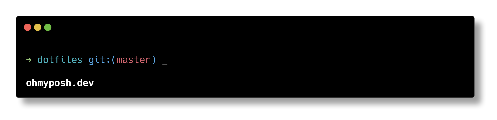

# dotfiles
🔧💻  kidchenko's `.files` macOS / Windows - including `~/.macos`, `~/.gitconfig`, `.zshrc`, `.vimrc`, `powershell profile`, etc.

## Font

Delugia

# Install

## Mac

`sh -c "$(curl -fsSL https://raw.github.com/kidchenko/dotfiles/master/tools/install.sh)"`

## Windows

`Set-ExecutionPolicy Bypass -Scope Process -Force; [System.Net.ServicePointManager]::SecurityProtocol = [System.Net.ServicePointManager]::SecurityProtocol -bor 3072`

`iwr -useb 'https://raw.githubusercontent.com/kidchenko/dotfiles/master/tools/install.ps1' | iex`

# Features

- `zsh` and `pwsh` support;
- Smooth experience between mac and windows os;
- Fabulous .gitconfig;
- One-line installer;
- Auto-update;

# Setup

## Mac
### Installed Programs for Mac

- git
- brew
- brave

## Windows

- Use TLS 1.2
- Windows Long Path Enabled (no more path to long errors)

### Installed Programs for Windows

- git
- choco
- brave

### Powershell Modules

- posh-git
- PowerShellGet
- PSReadLine
- Terminal-Icons
- z

# Aliases

## WinMac compatibility

`grep` => `Find-Text` on pwsh

`alias cls="clear"` on zsh

`alias ii="open"` on zsh

## Easier navigation

`..` => `cd ..`

## Shortcuts

`dl` => `cd ~/Downloads`

`ko` => `cd ~/kidchenko`

`tw` => `cd ~/thoughtworks`

`g` => `git`

## List

`l` => `ls`

`la` = List all files

`lsd` = List only directories

`lsh` = List only hidden files

## Calendar

`week` = Get week number

`today` = Get current date

## Update

`update` = Update Choco/Homebrew

## Browser

`brave` = Open brave

## Network

`ip` = Get ip

`localip` = Get local ip

## Hash

`md5` = Generate md5 from input

`sha1` = Generate sha1 from input

`sha256` = Generate sha256 from input

# Path

`path` = Print $PATH

# Profile

`reload` = Reload profile

`profile` = Print profile

Add Kannan

Built with <3 in Bangkok.
