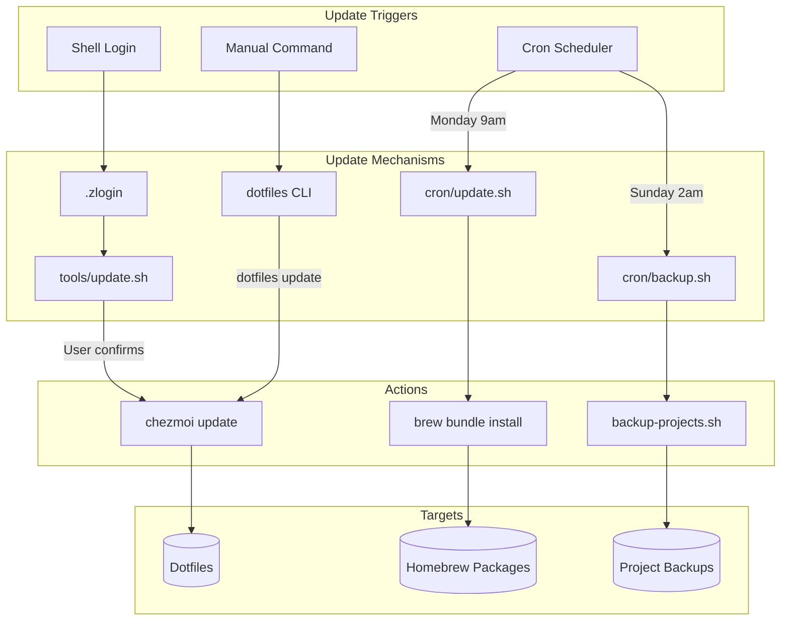
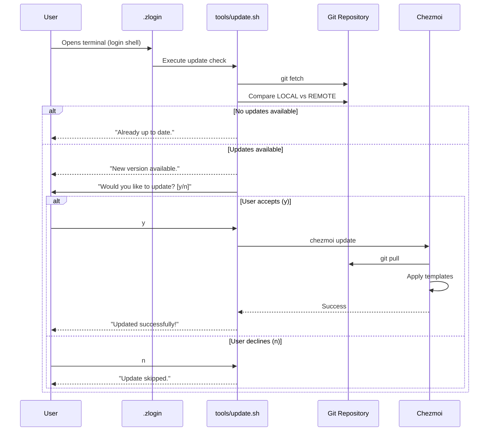
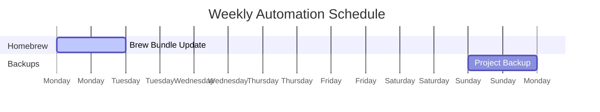
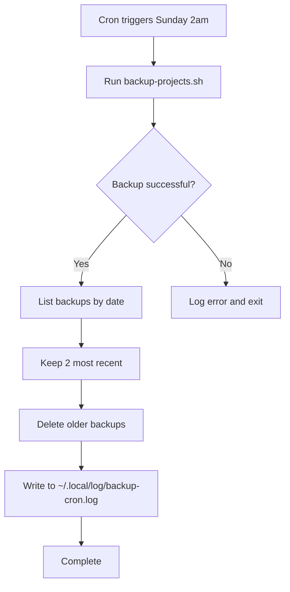
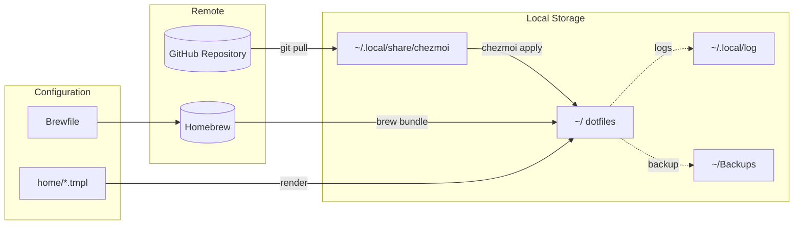
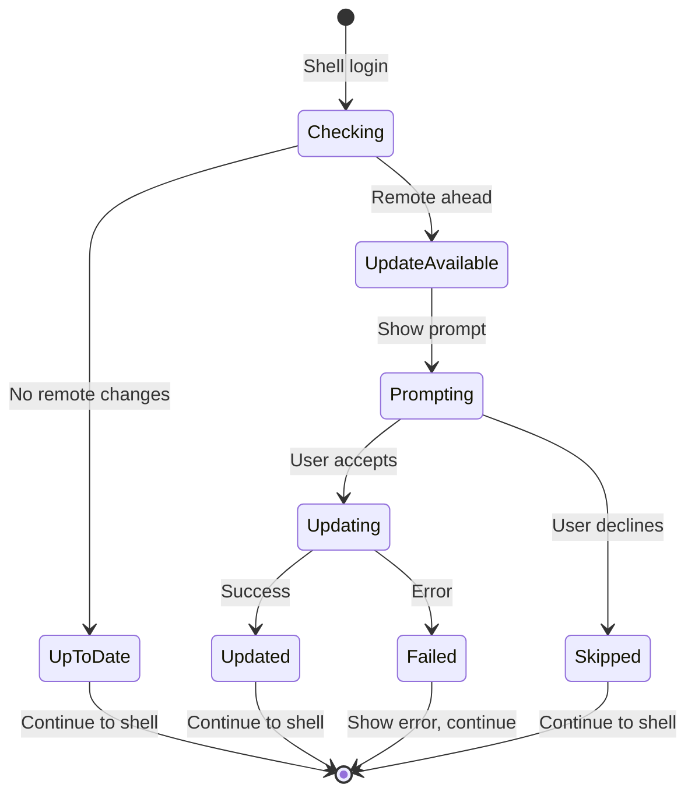

# Auto-Update System

This document explains how the dotfiles repository keeps itself and your system packages automatically updated.

## Overview

The dotfiles use a **hybrid auto-update approach** with three mechanisms:

1. **Interactive Updates** - Prompted on shell login
2. **Scheduled Updates** - Cron jobs for background maintenance
3. **Manual Updates** - On-demand via CLI commands

## Architecture Diagram



## Interactive Updates (Shell Login)

When you open a new terminal login shell, the system automatically checks for dotfiles updates.

### Flow Diagram



### How It Works

1. **Trigger**: `.zlogin` runs on every login shell
2. **Location**: `tools/update.sh`
3. **Process**:
   - Fetches remote changes (`git fetch`)
   - Compares local HEAD with remote HEAD
   - Prompts user if updates exist
   - Runs `chezmoi update` if user confirms

### Files Involved

| File | Purpose |
|------|---------|
| `home/dot_zlogin.tmpl` | Calls update script on login |
| `tools/update.sh` | Checks for updates and prompts user |

## Scheduled Updates (Cron Jobs)

Background tasks run automatically on a schedule to keep packages updated and backups current.

### Schedule Overview



| Day | Time | Task | Script |
|-----|------|------|--------|
| Monday | 9:00 AM | Homebrew updates | `cron/update.sh` |
| Sunday | 2:00 AM | Project backups | `cron/backup.sh` |

### Cron Update Flow (Homebrew)

```mermaid
flowchart TD
    START[Cron triggers Monday 9am] --> DETECT{Detect Homebrew}

    DETECT -->|Apple Silicon| ARM[/opt/homebrew/bin/brew]
    DETECT -->|Intel Mac| INTEL[/usr/local/bin/brew]
    DETECT -->|Not found| ERROR[Exit with error]

    ARM --> UPDATE[brew update]
    INTEL --> UPDATE

    UPDATE --> BUNDLE[brew bundle install]
    BUNDLE --> LOG[Write to ~/.local/log/brew-bundle.log]
    LOG --> DONE[Complete]
```

### Cron Backup Flow



### Cron Job Configuration

Jobs are defined in `cron/setup-cron.sh`:

```bash
CRON_JOBS=(
    "update.sh|0 9 * * 1|Weekly brew bundle (Monday 9am)"
    "backup.sh|0 2 * * 0|Weekly backup (Sunday 2am)"
)
```

### Cron Schedule Format

```
┌───────────── minute (0-59)
│ ┌───────────── hour (0-23)
│ │ ┌───────────── day of month (1-31)
│ │ │ ┌───────────── month (1-12)
│ │ │ │ ┌───────────── day of week (0-6, 0=Sunday)
│ │ │ │ │
* * * * *
```

### Files Involved

| File | Purpose |
|------|---------|
| `cron/setup-cron.sh` | Installs cron jobs |
| `cron/update.sh` | Homebrew bundle updates |
| `cron/backup.sh` | Project backup with retention |

## Complete System Flow

```mermaid
flowchart TB
    subgraph "Bootstrap (One-time)"
        BOOTSTRAP[tools/bootstrap.sh]
        INSTALL_BREW[Install Homebrew]
        INSTALL_CHEZMOI[Install Chezmoi]
        APPLY_DOTFILES[Apply Dotfiles]
        SETUP_CRON[Setup Cron Jobs]

        BOOTSTRAP --> INSTALL_BREW
        INSTALL_BREW --> INSTALL_CHEZMOI
        INSTALL_CHEZMOI --> APPLY_DOTFILES
        APPLY_DOTFILES --> SETUP_CRON
    end

    subgraph "Daily Operation"
        TERMINAL[Open Terminal]
        CHECK[Check for updates]
        PROMPT{Updates available?}
        USER_CHOICE{User accepts?}
        APPLY[chezmoi update]
        SKIP[Skip update]

        TERMINAL --> CHECK
        CHECK --> PROMPT
        PROMPT -->|Yes| USER_CHOICE
        PROMPT -->|No| DONE1[Continue to shell]
        USER_CHOICE -->|Yes| APPLY
        USER_CHOICE -->|No| SKIP
        APPLY --> DONE1
        SKIP --> DONE1
    end

    subgraph "Weekly Automation"
        CRON_MONDAY[Monday 9am]
        CRON_SUNDAY[Sunday 2am]
        BREW_UPDATE[Update Homebrew packages]
        BACKUP_RUN[Run backup]

        CRON_MONDAY --> BREW_UPDATE
        CRON_SUNDAY --> BACKUP_RUN
    end
```



## Log Files

All automated tasks log their output:

| Log File | Contents | View Command |
|----------|----------|--------------|
| `~/.local/log/brew-bundle.log` | Homebrew update output | `dotfiles logs brew` |
| `~/.local/log/backup-cron.log` | Backup operation output | `dotfiles logs backup` |

### Log Format

```
[2024-01-15 09:00:01] === Starting brew bundle install ===
[2024-01-15 09:00:05] Homebrew updated
[2024-01-15 09:00:30] Brew bundle install completed successfully
[2024-01-15 09:00:30] === Finished ===
```

## Manual Commands

| Command | Description |
|---------|-------------|
| `dotfiles update` | Pull and apply latest dotfiles |
| `dotfiles cron` | List scheduled tasks |
| `dotfiles cron setup` | Install/reinstall cron jobs |
| `dotfiles logs` | List available logs |
| `dotfiles logs brew` | View Homebrew update logs |
| `dotfiles logs backup` | View backup logs |

## Data Flow Diagram



## State Diagram



## Adding New Scheduled Tasks

1. Create a script in `cron/`:

```bash
#!/usr/bin/env bash
# cron/my-task.sh
LOG_FILE="${HOME}/.local/log/my-task.log"
echo "[$(date)] Running my task..." >> "$LOG_FILE"
# Your task here
```

2. Add entry to `cron/setup-cron.sh`:

```bash
CRON_JOBS=(
    "update.sh|0 9 * * 1|Weekly brew bundle (Monday 9am)"
    "backup.sh|0 2 * * 0|Weekly backup (Sunday 2am)"
    "my-task.sh|0 12 * * *|Daily task (noon)"  # New entry
)
```

3. Run setup:

```bash
dotfiles cron setup
```

## Troubleshooting

### Updates not running on login

Check that `.zlogin` is being executed:

```bash
# Verify the file exists
ls -la ~/.zlogin

# Check the update script is executable
ls -la ~/.local/share/chezmoi/tools/update.sh
```

### Cron jobs not running

```bash
# Check crontab entries
crontab -l

# Verify scripts are executable
ls -la ~/.local/share/chezmoi/cron/

# Re-run setup
dotfiles cron setup
```

### View cron logs

```bash
# Recent brew updates
dotfiles logs brew

# Recent backups
dotfiles logs backup

# Or directly
tail -50 ~/.local/log/brew-bundle.log
```

## Platform Support

| Feature | macOS | Linux | Windows |
|---------|-------|-------|---------|
| Interactive updates | Yes | Yes | No |
| Cron jobs | Yes | No* | No |
| Homebrew updates | Yes | Yes** | No |

\* Linux uses systemd timers (not implemented)
\** Linux Homebrew (Linuxbrew) supported

## Related Documentation

- [dotfiles update](commands/update.md) - Manual update command
- [dotfiles cron](commands/cron.md) - Cron management
- [dotfiles logs](commands/logs.md) - Log viewing
- [Bootstrap Guide](installation.md) - Initial setup
