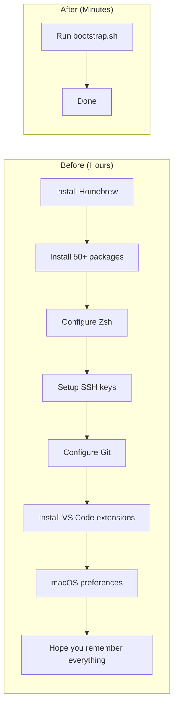
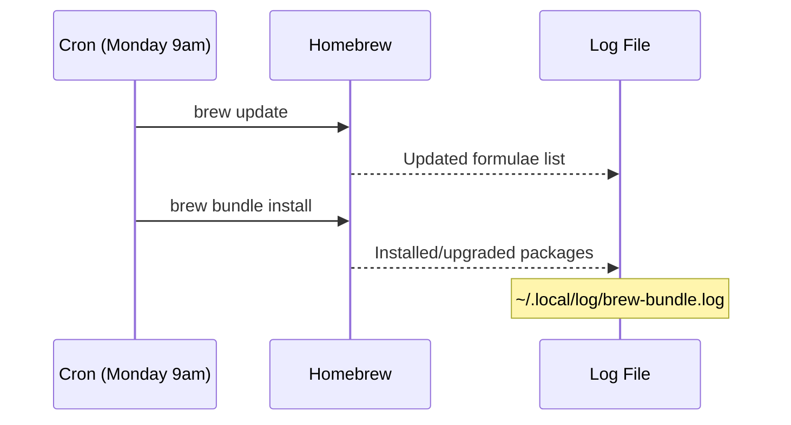
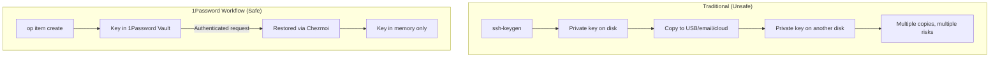
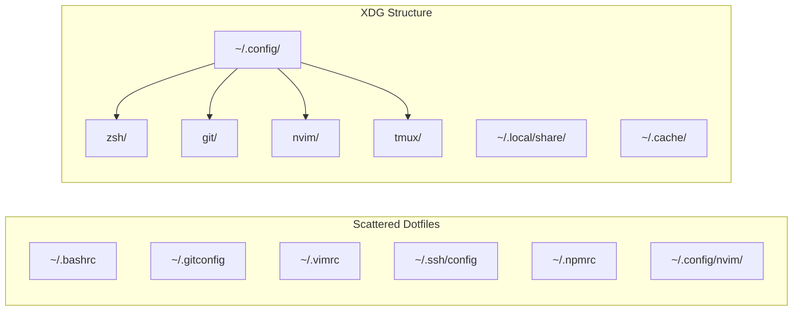
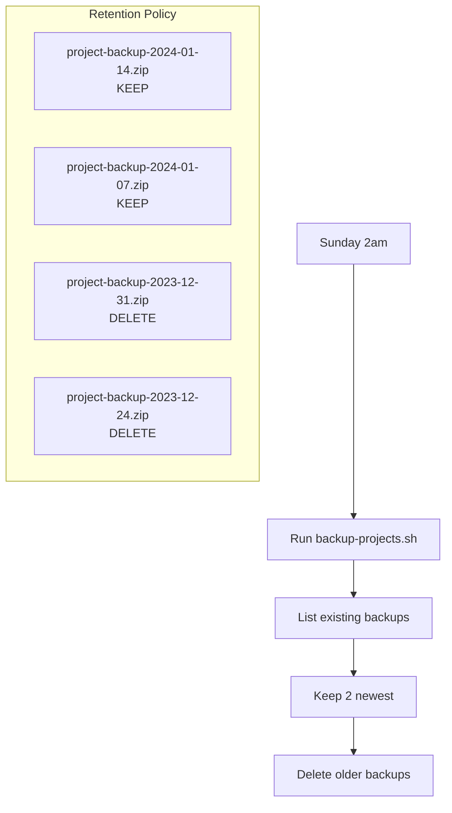
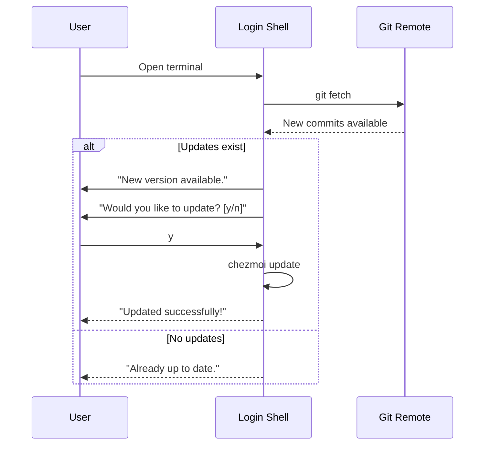

# Problem Statement

## The Challenge of Developer Environment Management

Setting up and maintaining a development environment is a recurring pain point for software developers. Every new machine, OS reinstall, or team onboarding requires hours of manual configuration that is error-prone and difficult to reproduce.

## Problems This Project Solves

### 1. New Machine Setup Takes Hours

**The Problem:**
Starting fresh on a new machine means manually installing dozens of tools, configuring shells, setting up SSH keys, and tweaking system preferences. This can take a full day or more, and you inevitably forget something.

**The Solution:**
A single command bootstraps everything:
```bash
bash -c "$(curl -fsSL https://raw.githubusercontent.com/kidchenko/dotfiles/main/tools/bootstrap.sh)"
```



### 2. Configuration Drift Between Machines

**The Problem:**
Over time, configurations diverge between your work laptop, personal machine, and servers. A fix made on one machine is lost on others. There's no single source of truth.

**The Solution:**
Git-tracked dotfiles with templating. All configurations live in one repository, with machine-specific variations handled through Chezmoi templates.

```mermaid
flowchart TB
    subgraph Problem["Configuration Drift"]
        WORK[Work Laptop<br>Git config: work@company.com]
        HOME[Home Desktop<br>Git config: personal@gmail.com]
        SERVER[Server<br>Git config: ???]

        WORK -.->|Different| HOME
        HOME -.->|Different| SERVER
    end

    subgraph Solution["Single Source of Truth"]
        REPO[(Git Repository)]
        TEMPLATE[".gitconfig.tmpl<br>email = {{ .email }}"]

        REPO --> TEMPLATE
        TEMPLATE -->|work machine| WORK2[work@company.com]
        TEMPLATE -->|home machine| HOME2[personal@gmail.com]
        TEMPLATE -->|server| SERVER2[server@domain.com]
    end
```

### 3. Forgotten or Outdated Packages

**The Problem:**
Packages get outdated. Security vulnerabilities go unpatched. You install a tool once and forget to update it for months. Homebrew updates require manual intervention.

**The Solution:**
Automated weekly updates via cron. Every Monday at 9am, Homebrew packages are updated automatically, with logs for visibility.



### 4. Secret Management is Dangerous

**The Problem:**
SSH private keys sitting on disk are a security risk. Copying keys between machines means they touch multiple filesystems. Accidental commits of secrets to git are common.

**The Solution:**
SSH keys are generated directly in 1Password. The private key never touches disk during generation. Keys are restored on new machines through 1Password CLI integration.



### 5. Dotfiles Are Scattered and Disorganized

**The Problem:**
Configuration files live in different locations: `~/.bashrc`, `~/.config/git/config`, `~/.ssh/config`, etc. Some tools follow XDG, others don't. It's chaos.

**The Solution:**
XDG Base Directory compliance. All configurations are organized under standard paths, with Chezmoi managing the mapping.



### 6. No Visibility Into System State

**The Problem:**
Is my setup healthy? Are all tools installed? Is 1Password authenticated? Are cron jobs running? Without a health check, problems go unnoticed until they cause failures.

**The Solution:**
A comprehensive doctor command that validates the entire setup:

```bash
$ dotfiles doctor
[dotfiles] Running health checks...

  Core Tools
    ✓ chezmoi installed (v2.40.0)
    ✓ git installed (v2.42.0)
    ✓ zsh installed (v5.9)
    ✓ homebrew installed

  Security
    ✓ 1Password CLI authenticated
    ✓ SSH key exists (~/.ssh/id_ed25519)

  Automation
    ✓ Cron job: Weekly brew bundle (Monday 9am)
    ✓ Cron job: Weekly backup (Sunday 2am)
```

### 7. Backups Are an Afterthought

**The Problem:**
Project backups are important but tedious. Without automation, they don't happen. When they do happen manually, old backups pile up consuming disk space.

**The Solution:**
Automated weekly backups with retention policy. Every Sunday at 2am, projects are backed up. Only the 2 most recent backups are kept.



### 8. Updates Require Manual Intervention

**The Problem:**
Dotfiles updates require you to remember to pull changes. You make an improvement on one machine and forget to apply it elsewhere for weeks.

**The Solution:**
Interactive update prompts on shell login. When you open a terminal, the system checks for updates and asks if you want to apply them.



## Summary: Before and After

| Problem | Before | After |
|---------|--------|-------|
| New machine setup | Hours of manual work | Single command, minutes |
| Configuration drift | Different configs everywhere | One repo, templated variations |
| Package updates | Manual, forgotten | Automated weekly |
| SSH key security | Keys on disk | Keys in 1Password |
| File organization | Scattered dotfiles | XDG structure |
| System health | Unknown state | `dotfiles doctor` |
| Backups | Manual, inconsistent | Automated with retention |
| Dotfile updates | Forgotten | Prompted on login |

## Design Principles

This dotfiles project follows these principles:

1. **Automation over manual work** - If it can be automated, it should be
2. **Single source of truth** - One repository for all configurations
3. **Security first** - Secrets never touch disk unnecessarily
4. **Visibility** - Health checks and logs for everything automated
5. **User control** - Prompts before changes, not silent updates
6. **Cross-platform** - Works on macOS, Linux, and Windows where possible
7. **XDG compliance** - Standard directory structure
8. **Idempotent operations** - Safe to run multiple times

## Target Audience

This project is designed for:

- **Software developers** who work across multiple machines
- **DevOps engineers** who need reproducible environments
- **Anyone** tired of manually setting up their development environment
- **Security-conscious users** who want proper secret management
